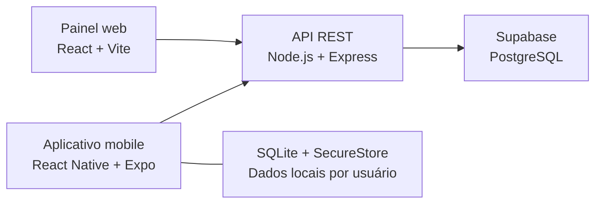

<p align="center">
  
</p>

<h1 align="center">REVIVE</h1>

<p align="center">Acompanhamento de hábitos, metas e progresso na jornada de recuperação.</p>

<p align="center">
  <a href="https://github.com/VitorYunguiar/revive/actions/workflows/tests.yml"></a>
</p>

<p align="center">
  <a href="https://revive-beryl.vercel.app">Demonstração web</a> ·
  <a href="docs/guia-avaliacao.md">Roteiro de avaliação</a> ·
  <a href="docs/README.md">Documentação</a> ·
  <a href="revive-mobile/README.md">Aplicativo Android</a>
</p>

## O projeto

O REVIVE é um Projeto Integrador da UniEvangélica voltado ao acompanhamento da recuperação de vícios. Reúne um painel web responsivo e um aplicativo mobile conectados à mesma API, com registros diários, metas e visualização do progresso.

O objetivo é oferecer uma forma organizada de acompanhar a jornada pessoal. O aplicativo não substitui acompanhamento profissional.

## Funcionalidades

| Área | Recursos implementados |
| --- | --- |
| Conta | Cadastro, login, perfil e encerramento de sessão |
| Hábitos | Cadastro, acompanhamento de abstinência e estimativa de economia |
| Registros | Check-ins, humor, observações e histórico de recaídas |
| Metas | Criação, acompanhamento e conclusão de objetivos |
| Progresso | Dashboard, indicadores, calendário e conquistas |
| Mobile | Cache por usuário, fila de sincronização, lembretes locais e exportação de dados |

A sincronização offline possui [limitações conhecidas](docs/roadmap.md). O APK é destinado a testes internos; a homologação em aparelho físico ainda está pendente.

## Arquitetura



Os clientes acessam o banco pela API. Credenciais privilegiadas ficam no servidor. Veja as [decisões e os fluxos de arquitetura](docs/arquitetura-fluxograma.md).

## Começar pelo ambiente local

Requisitos: **Node.js 22**, npm, Git e um projeto Supabase com o esquema base configurado.

```bash
git clone https://github.com/VitorYunguiar/revive.git
cd revive
npm ci
npm ci --prefix revive-painel
```

Copie `.env.example` para `.env`, preencha as credenciais da API conforme o [guia de instalação](docs/instalacao.md) e execute:

```bash
npm run dev:stack
```

O painel abre normalmente em `http://localhost:5173`, com API em `http://localhost:3000/api`. Para o aplicativo, siga o [guia mobile](revive-mobile/README.md).

**Banco novo:** as migrações atuais dependem de um esquema base ainda não versionado. A [Issue #6](https://github.com/VitorYunguiar/revive/issues/6) acompanha essa pendência. A suíte automatizada pode ser executada sem banco e sem credenciais reais.

## Qualidade e validação

```bash
# API, painel e build web
npm run validate

# Links locais da documentação
npm run check:docs

# Tipos, lint e testes do mobile
npm ci --prefix revive-mobile
npm run validate --prefix revive-mobile
```

O [GitHub Actions](https://github.com/VitorYunguiar/revive/actions/workflows/tests.yml) executa a validação da API/painel, a conferência dos links e a validação do mobile. Os comandos, o escopo e os limites de cada suíte estão no [guia de testes](docs/testes.md).

## Organização do repositório

| Caminho | Conteúdo |
| --- | --- |
| `index.js` e `mobile-api.js` | API e regras de acesso aos dados |
| `revive-painel/` | Aplicação web e seus testes |
| `revive-mobile/` | Aplicativo, testes e guias Android |
| `supabase/` | Migrações e orientações sobre o banco |
| `tests/` | Testes unitários e de integração da API |
| `docs/` | Guias atuais, evidências e entregas acadêmicas |
| `.github/` | Automação e modelos de Issues/PRs |

## Documentação e evolução

- [Roteiro de avaliação](docs/guia-avaliacao.md): caminhos para explorar o produto e conferir evidências.
- [Central de documentação](docs/README.md): instalação, arquitetura, publicação e entregas acadêmicas.
- [Próximas melhorias](docs/roadmap.md): pendências reais vinculadas às Issues.
- [Como contribuir](CONTRIBUTING.md): tarefas, branches, commits, validação e revisão.
- [Releases](https://github.com/VitorYunguiar/revive/releases): distribuição de arquivos, incluindo o instalador Node.js, com origem e checksum.

As alterações são registradas em [Issues](https://github.com/VitorYunguiar/revive/issues) e integradas por [Pull Requests](https://github.com/VitorYunguiar/revive/pulls?q=is%3Apr+is%3Amerged), preservando o histórico de desenvolvimento.
