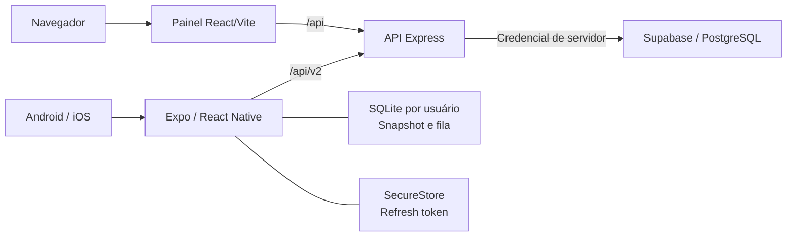
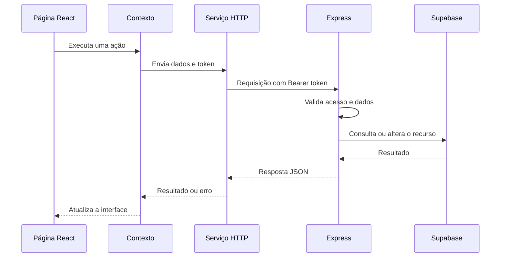

# Arquitetura do REVIVE

## Visão geral

O repositório reúne uma API Express, um painel React e um aplicativo Expo/React Native. Os dois clientes compartilham o domínio e o banco de dados por meio da API, com contratos de autenticação próprios para web e mobile.

## Responsabilidades

| Camada | Responsabilidade | Código |
| --- | --- | --- |
| API principal | Configuração HTTP, rotas web, autorização e acesso ao banco | [`index.js`](../index.js) |
| API mobile | Sessões, bootstrap e mutações v2 | [`mobile-api.js`](../mobile-api.js) |
| Painel | Rotas, componentes, estado e serviços HTTP | [`revive-painel/src`](../revive-painel/src) |
| Mobile | Telas, cache local, autenticação e sincronização | [`revive-mobile/src`](../revive-mobile/src) |
| Dados | Migrações de metas, sessões, idempotência e permissões | [`supabase`](../supabase/README.md) |
| Publicação | Adaptação serverless e build web | [`api/[...path].js`](../api/%5B...path%5D.js) e [`vercel.json`](../vercel.json) |

A API mantém boa parte das regras em dois módulos. A divisão em serviços menores pode ser feita de forma incremental conforme novas alterações exigirem; a organização atual não é descrita como uma arquitetura de microsserviços.

## Painel web

O roteamento fica em `revive-painel/src/App.jsx`. Os contextos de autenticação, dados e interface coordenam o estado; os arquivos em `services/` centralizam as chamadas à API. O endereço é resolvido em `src/config/env.js` a partir de `VITE_API_URL` ou dos padrões de desenvolvimento/produção.

O painel armazena o token em `localStorage`. A API verifica o token e a propriedade dos recursos nas operações protegidas. Consulte as rotas disponíveis em `/api/docs` com a API em execução.

## Aplicativo mobile

- Expo Router organiza as telas públicas e autenticadas.
- O access token fica em memória; o refresh token é armazenado no SecureStore.
- A API implementa rotação e revogação de sessões mobile.
- SQLite mantém snapshots e mutações pendentes separados por usuário.
- A sincronização reenvia mutações usando chaves de idempotência.

A atomicidade entre mutação e resposta idempotente ainda está em evolução ([Issue #8](https://github.com/VitorYunguiar/revive/issues/8)). A homologação de modo avião em aparelho também permanece aberta ([Issue #7](https://github.com/VitorYunguiar/revive/issues/7)).

Detalhes: [decisão de arquitetura](../revive-mobile/docs/adr-0001-mobile-architecture.md), [contratos da API](../revive-mobile/docs/api-contracts.md) e [estado da implementação](../revive-mobile/docs/implementation-status.md).

## Banco de dados

O domínio utiliza `usuarios`, `vicios`, `registros_diarios`, `historico_recaidas`, `metas` e `mensagens_motivacionais`. As migrações também definem estruturas de sessões, idempotência e dispositivos para o mobile.

O esquema base ainda precisa ser versionado para permitir a reprodução em banco vazio. Veja as [orientações do banco](../supabase/README.md) e a [Issue #6](https://github.com/VitorYunguiar/revive/issues/6).

## Publicação e automação

Na Vercel, o build do painel é servido como conteúdo estático e as rotas `/api/*` são encaminhadas ao adaptador Express. Localmente, Vite e Express rodam como processos separados. A configuração alternativa do Render executa o servidor Node.

O [workflow de testes](../.github/workflows/tests.yml) verifica os links da documentação, os testes de API/painel, o build web e, em um job separado, tipos, lint e testes do mobile. A publicação de um build não substitui os testes manuais descritos no [checklist mobile](../revive-mobile/docs/release-checklist.md).
